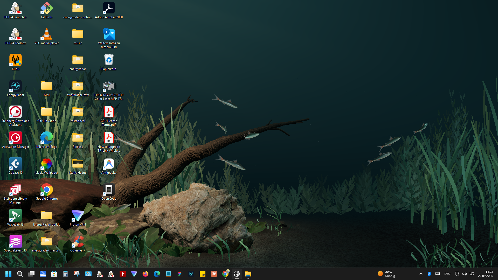
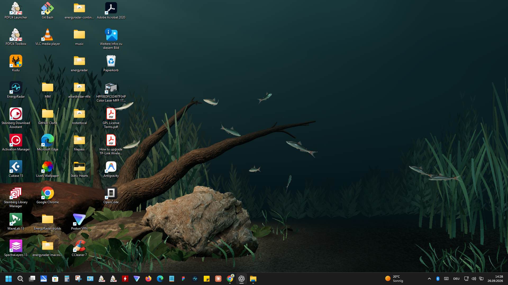

# Aquarium Atmosphere Pass

Branch: `codex/aquarium-atmosphere-pass`, from accepted planting candidate `4c6f754`. Not merged.

The planting, hardscape, camera, fish, geometry asset and asset manifest are unchanged. This pass changes only runtime atmosphere: a faint rippled surface brightening at the top; slower, softer caustics on the environment; gentle height-based light falloff; stronger teal depth haze on distant growth; slower coherent sway, strongest on tall ribbons through their existing height weights; and sparse point sprites whose visibility follows the upper light. There is no glass frame, bloom, new asset or new draw call.

## Real Windows desktop, 1920×1080

| BEFORE: accepted planting | AFTER: atmosphere pass |
|---|---|
|  |  |

The comparison uses two clean real-desktop captures with the same composition and desktop icons. Fish positions differ because the school runs continuously. The after frame has a softly brighter upper water zone, a darker substrate, and lower contrast in the rear plant bank. Moving caustics, particles and sway are deliberately subtle and cannot be judged fully from still frames.

## Runtime verification

| 1920×1080 real host | Accepted planting | Atmosphere pass |
|---|---:|---:|
| Steady diagnostic FPS | 60.0 | 60.0 |
| Draw calls / rendered triangles | 13 / 114,076 | 13 / 114,076 |
| Mean attributed GPU, 30 s | 73.5% | 73.8% |
| Paused attributed GPU, 12 s | 0% | 0% |

The two GPU samples ran at different times and are guardrails rather than a controlled benchmark. Both new samples were `CONCLUSIVE`: one Aquarium root, running session, no attachment failure, and host alive through sampling. The running sample records six steady 60.0 FPS diagnostic windows; the paused probe reports `paused=true`, `fps=0.0`, 0% attributed GPU and 0% sampled CPU. Raw samples are `running-30s.json` and `paused-12s.json` beside the screenshots.

`build.ps1 -Target All` passed: 70 JS tests, native fish-logic and host-policy tests, WebView2 probe, and the x64 `/W4 /WX` host build. No native host, simulation, input or pacing code changed.
